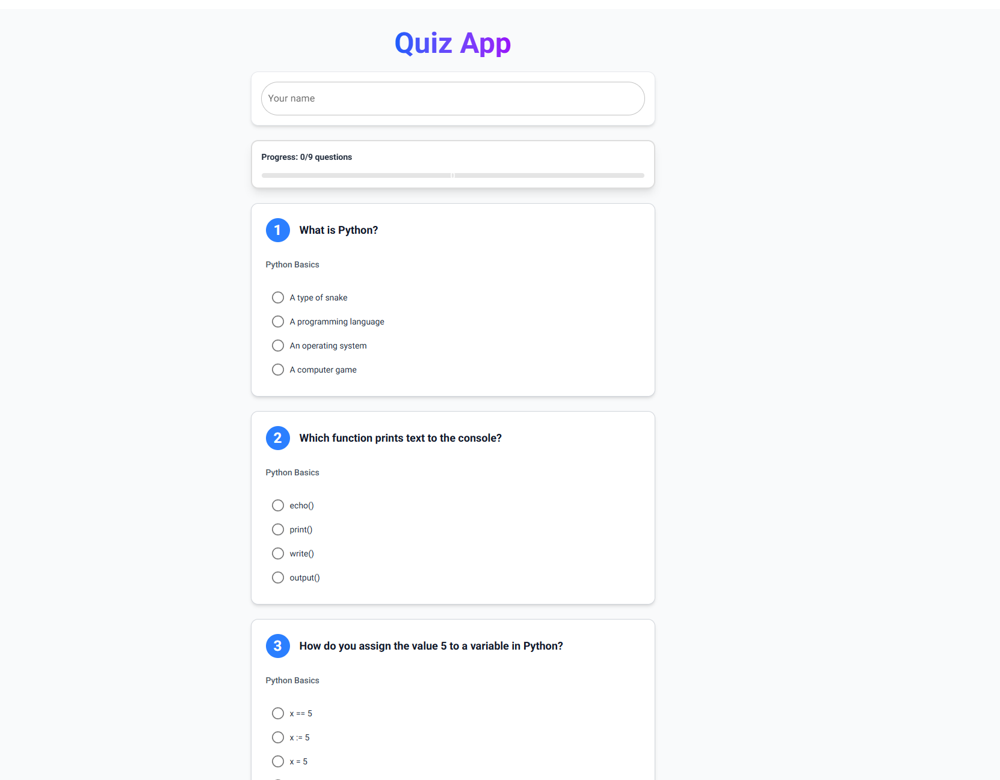
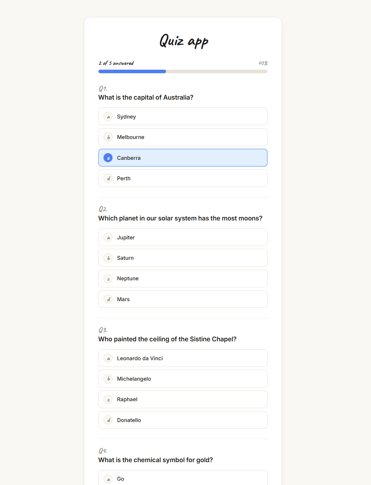

# 🧠 Quiz App – Quiz App by Lars Baumgartner, Noel Anton and Joshua Meng

---

QuizApp (QuizRP) is a browser-based quiz application written in Python with **NiceGUI**. A player enters their name, answers a series of multiple-choice questions, and immediately receives a percentage score, a Swiss-scale grade from **1 to 6**, and a downloadable **PDF certificate** of their attempt. An admin area at `/admin` lets staff manage the question pool and review every attempt that has ever been submitted.

The project is designed as a complete end-to-end demonstration of:

- a full **layered architecture** (domain → data access → services → UI)
- **data validation** declared directly on the domain models
- **persistent storage** through an ORM (SQLModel on top of SQLAlchemy)
- automated **PDF generation** via ReportLab
- a clean **MVC-inspired** split between controllers, services, and views
- a tested, maintainable Python codebase suitable for teamwork

---

## 📝 Application Requirements

### Problem

Most of the times when someone wants to create a Quiz, they do that by hand and a piece of paper. THis takes long and the feedback is written by hand aswell. This leads to a long waiting time and many human errors.

### Scenario

QuizApp solves this by offering a small, self-contained web app where players can:

- take the quiz
- get an instant feedback with a grade on the Swiss 1–6 scale
- see a clear PASSED / NOT PASSED indicator (passing = grade ≥ 4.0)
- download a PDF certificate listing every answer they gave

…and where an admin can:

- add new questions to the pool through a form
- delete obsolete or wrong questions with one click
- review the full history of past attempts

---

## 📖 User Stories

### 1. Play a Quiz
**As a player, I want to answer a set of multiple-choice questions in the browser.**

- **Inputs:** player name (`str`), selected option per question (`int`)
- **Outputs:** list of questions (`list[Question]`)

### 2. Submit and Get Graded
**As a player, I want my answers graded automatically with a percentage score and a 1–6 grade.**

- **Inputs:** submitted answers (`dict[question_id, selected_index]`)
- **Outputs:** number correct, score in percent, grade on the 1–6 scale

### 3. Pass / Fail Indication
**As a player, I want to immediately see whether I passed (grade ≥ 4.0) or not.**

- **Inputs:** grade (`float`)
- **Outputs:** PASSED / NOT PASSED indicator

### 4. Generate Result Certificate
**As a player, I want a certificate to be created and saved as a PDF file.**

- **Inputs:** completed attempt
- **Outputs:** PDF certificate, file path

### 5. View Past Attempts (Admin)
**As an admin, I want to view past attempts ordered by date.**

- **Inputs:** optional limit (`int`)
- **Outputs:** list of attempts (`list[Attempt]`)

### 6. Manage the Question Pool (Admin)
**As an admin, I want to add new questions and delete obsolete ones without touching the source code.**

- **Inputs:** question text, category, options, correct-answer index — or a question ID to delete
- **Outputs:** updated question list in the database

---

## 🧩 Use Cases

### Main Use Cases
- Start Quiz (Player)
- Answer Questions (Player)
- View Result & Certificate (Player)
- Manage Questions – Add / Delete (Admin)
- View Past Attempts (Admin)

### Actors
- **Player** – takes the quiz and receives a result
- **Admin** – curates the question pool and reviews attempts

---

### Wireframes / Mockups

---

## 🏛️ Architecture

To do Noel

---

## 🗄️ Database and ORM

To do Noel

---

## ✅ Project Requirements

To do Noel

---

## ⚙️ Implementation

To do Lars

---

## 📂 Repository Structure

to do Lars

---

### How to Run

to do Lars

---

## 🧪 Testing

to do Lars

## 👥 Team & Contributions

| Name              | Contribution                                                          |
|-------------------|-----------------------------------------------------------------------|
| Joshua Meng       | NiceGUI UI (quiz and admin pages, styling) + documentation            |
| Noel Anton        | Database & ORM (models, DAOs, schema, seeding) + documentation        |
| Lars Baumgartner  | Business logic (services, controllers, grading, certificates), full test suite (`tests/`) + documentation |

