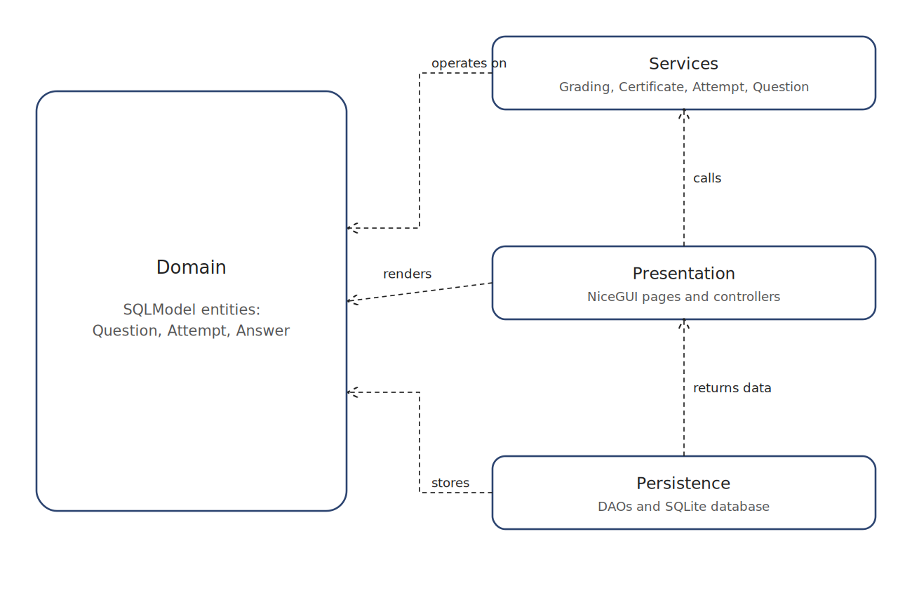
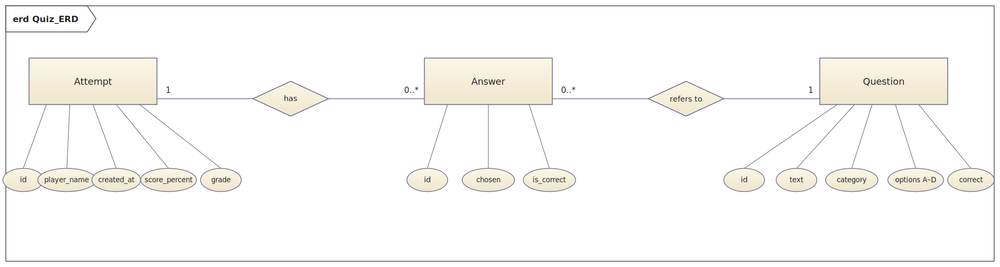

# 🧠 Quiz App – Quiz App by Lars Baumgartner, Noel Anton and Joshua Meng


---

QuizApp (QuizRP) is a browser-based quiz application written in Python with **NiceGUI**. A player enters their name, answers a series of multiple-choice questions, and immediately receives a percentage score, a Swiss-scale grade from **1 to 6**, and a downloadable **PDF certificate** of their attempt. An admin area at `/admin` lets staff manage the question pool and review every attempt that has ever been submitted.

The project is designed as a complete end-to-end demonstration of:

- a full **layered architecture** (domain → data access → services → UI)
- **data validation** declared directly on the domain models
- **persistent storage** through an ORM (SQLModel on top of SQLAlchemy)
- automated **PDF generation** via ReportLab
- a clean **MVC-inspired** split between controllers, services, and views
- a tested, maintainable Python codebase suitable for teamwork

---

## 📝 Application Requirements

### Problem

Most of the times when someone wants to create a Quiz, they do that by hand and a piece of paper. THis takes long and the feedback is written by hand aswell. This leads to a long waiting time and many human errors.

### Scenario

QuizApp solves this by offering a small, self-contained web app where players can:

- take the quiz
- get an instant feedback with a grade on the Swiss 1–6 scale
- see a clear PASSED / NOT PASSED indicator (passing = grade ≥ 4.0)
- download a PDF certificate listing every answer they gave

…and where an admin can:

- add new questions to the pool through a form
- delete obsolete or wrong questions with one click
- review the full history of past attempts

---

## 📖 User Stories

### 1. Play a Quiz
**As a player, I want to answer a set of multiple-choice questions in the browser.**

- **Inputs:** player name (`str`), selected option per question (`int`)
- **Outputs:** list of questions (`list[Question]`)

### 2. Submit and Get Graded
**As a player, I want my answers graded automatically with a percentage score and a 1–6 grade.**

- **Inputs:** submitted answers (`dict[question_id, selected_index]`)
- **Outputs:** number correct, score in percent, grade on the 1–6 scale

### 3. Pass / Fail Indication
**As a player, I want to immediately see whether I passed (grade ≥ 4.0) or not.**

- **Inputs:** grade (`float`)
- **Outputs:** PASSED / NOT PASSED indicator

### 4. Generate Result Certificate
**As a player, I want a certificate to be created and saved as a PDF file.**

- **Inputs:** completed attempt
- **Outputs:** PDF certificate, file path

### 5. View Past Attempts (Admin)
**As an admin, I want to view past attempts ordered by date.**

- **Inputs:** optional limit (`int`)
- **Outputs:** list of attempts (`list[Attempt]`)

### 6. Manage the Question Pool (Admin)
**As an admin, I want to add new questions and delete obsolete ones without touching the source code.**

- **Inputs:** question text, category, options, correct-answer index — or a question ID to delete
- **Outputs:** updated question list in the database

---

## 🧩 Use Cases


### Main Use Cases
- Start Quiz (Player)
- Answer Questions (Player)
- View Result & Certificate (Player)
- Manage Questions – Add / Delete (Admin)
- View Past Attempts (Admin)

### Actors
- **Player** – takes the quiz and receives a result
- **Admin** – curates the question pool and reviews attempts

---

### Wireframes / Mockups


---

## 🏛️ Architecture



### Layers
- **UI** – NiceGUI pages and controllers ([`quiz_app/ui/`](quiz_app/ui/))
- **Application logic** – services for grading, certificates, attempts and questions ([`quiz_app/services/`](quiz_app/services/))
- **Persistence** – SQLite + SQLModel + DAOs ([`quiz_app/data_access/`](quiz_app/data_access/))
- **Domain** – pure ORM models with built-in validation ([`quiz_app/domain/models.py`](quiz_app/domain/models.py))

### Design Decisions
- **MVC-inspired separation:** views (NiceGUI pages) talk only to controllers; controllers orchestrate services; services depend on DAOs; DAOs depend on the ORM. No UI code touches the database directly.
- **Composition root:** the `QuizApp` class in [`application.py`](quiz_app/application.py) is the single place where the database, DAOs, services, controllers and UI are wired together.
- **Stateless services:** services hold no per-request state, which makes them trivial to test with injected fakes or in-memory databases.

### Design Patterns Used
- **Layered MVC variant** – chosen because the application has a GUI, user interactions, business objects, and database access; a clean separation between them is essential.
- **Facade pattern** – the `Database` class hides engine creation, schema setup, and one-time seeding behind a small interface so callers do not need to know about SQLAlchemy details.
- **Data Access Object (DAO)** – `QuestionDAO` and `AttemptDAO` encapsulate every SQL/ORM access per entity, keeping services free of session handling.
- **Composition root** – `QuizApp.__init__` / `_build_pages` is the single wiring point for all dependencies.

---

## 🗄️ Database and ORM



The application uses **SQLModel** (built on SQLAlchemy) to map domain objects to a SQLite database. On first launch the schema is created automatically and, if the question table is empty, a default set of nine "Python Basics" questions is seeded.

### Entities
- `Question` – text, category, options, correct-answer index
- `Attempt` – player name, timestamp, totals, score and grade
- `Answer` – the selected option per question for a given attempt

### Relationships
- One `Attempt` → many `Answer`
- Each `Answer` references exactly one `Question`

---

## ✅ Project Requirements

Each app must meet the following criteria in order to be accepted (see also the official project guidelines PDF on Moodle):

1. Using NiceGUI for building an interactive web app
2. Data validation in the app
3. Using an ORM for database management

### 1. Browser-based App (NiceGUI)

The whole app runs as a small local web server. Players use it in the browser to:

- enter their name and start a quiz
- step through a styled list of multiple-choice questions with a live progress bar
- submit the quiz and see their score, grade, and pass/fail result
- download a generated PDF certificate

Admins additionally get a `/admin` page to add/delete questions and review past attempts.

**Architecture note (per SS26 guidelines):** the browser is a thin client; UI state and business logic live on the server-side NiceGUI app.

### 2. Data Validation

Validation rules are declared directly on the domain models, so invalid data can never reach the database:

- `player_name` length (2–60 characters)
- `text` length on questions (5–300 characters)
- `correct_index` and `selected_index` bounded (0–9)
- `score_percent` bounded (0–100), `grade` bounded (1.0–6.0)

The admin "add question" controller adds an extra layer of user-friendly checks (minimum 2 options, correct-index within range, etc.) and turns errors into in-browser `ui.notify` messages instead of crashes.

### 3. Database Management

All persistent data lives in **SQLite**, accessed exclusively via the SQLModel ORM. Question seeding, attempt creation, and attempt retrieval all go through the DAO layer — no service or UI module ever talks to SQL directly.

---

## ⚙️ Implementation

### Technology

- Python 3.10+
- NiceGUI
- SQLModel / SQLAlchemy
- ReportLab
- pytest

### 📚 Libraries Used

- **nicegui** – UI framework (browser-based)
- **sqlmodel** – ORM
- **sqlalchemy** – database toolkit (underneath SQLModel)
- **reportlab** – PDF generation
- **tzdata** – IANA time zone database (required on Windows so that `ZoneInfo("Europe/Zurich")` resolves on the admin page)
- **pytest** – testing

---

## 📂 Repository Structure

```text
quiz_app/
├── __init__.py
├── __main__.py
├── application.py
├── data_access/
│   ├── __init__.py
│   ├── dao.py
│   ├── db.py
│   └── seed.py
├── domain/
│   ├── __init__.py
│   └── models.py
├── services/
│   ├── __init__.py
│   ├── attempt_service.py
│   ├── certificate_service.py
│   ├── grading_service.py
│   └── question_service.py
└── ui/
    ├── __init__.py
    ├── controllers.py
    └── pages.py
```

---

### How to Run

### 1. Project Setup
- Python 3.10+ is required
- Create and activate a virtual environment:
   - **macOS/Linux:**
      ```bash
      python3 -m venv .venv
      source .venv/bin/activate
      ```
   - **Windows:**
      ```bash
      python -m venv .venv
      .venv\Scripts\Activate
      ```
- Install dependencies:
   ```bash
   pip install -r requirements.txt
   ```

### 2. Configuration
- Default database URL: SQLite under `data/` (created on first run)
- Default certificate output directory: `data/certificates/`
- Both paths are created automatically — no manual setup needed

### 3. Launch
- Start the NiceGUI app:
   ```bash
   py -m quiz_app
   ```
- Open the URL printed in the console (default: <http://127.0.0.1:8080>).

### 4. Usage

**Play the quiz**
1. Open the start page and enter your player name.
2. Step through the questions and select one answer per question.
3. Submit to see your number of correct answers, percentage score, and 1–6 grade.
4. Download the generated PDF certificate.

**Admin area**
1. Open `/admin` to access the dashboard.
2. Use the **Add a new question** form to extend the pool (text, category, four options, mark the correct one).
3. Click **Delete** next to any existing question to remove it.
4. Scroll down to the **Attempts** table to review past quiz runs.

---

## 🧪 Testing

Run all tests from the project root:

```bash
pytest
```

The suite contains **12 logical test cases** across three layers — unit, database and integration — covering grading logic, certificate behaviour, persistence, and end-to-end submission flow. All 12 cases pass; parametrised cases expand to a total of **19 individual pytest runs**.

Tests are organised in three files:

- `tests/test_unit.py` – service-level unit tests (no database)
- `tests/test_db.py` – database/DAO tests on an in-memory SQLite engine
- `tests/test_integration.py` – end-to-end flow via the real services

The reusable fixtures (in-memory `engine`, `seeded_engine`, all DAOs and services) live in `tests/conftest.py`.

---

### Test Case Catalogue

Each test below is described using the standard 9-field template.

#### TC_001 — Grading: all answers correct
- **Description:** Verify that `GradingService.evaluate` returns the maximum grade when every answer is correct.
- **Preconditions:** A fresh `GradingService` with default bounds (1.0 – 6.0).
- **Test steps:** Call `service.evaluate([True, True, True, True])` and read all three return values.
- **Test data/input:** Four `True` flags.
- **Expected result:** `num_correct = 4`, `score_percent = 100.0`, `grade = 6.0`.
- **Actual result:** Matches expected.
- **Status:** Pass
- **Comments:** Anchors the upper boundary of the grading scale. Implemented in `test_unit.py::test_grading_all_correct_returns_grade_six`.

#### TC_002 — Grading: all answers wrong
- **Description:** Verify that `GradingService.evaluate` returns the minimum grade when every answer is wrong.
- **Preconditions:** A fresh `GradingService` with default bounds.
- **Test steps:** Call `service.evaluate([False, False, False, False])`.
- **Test data/input:** Four `False` flags.
- **Expected result:** `num_correct = 0`, `score_percent = 0.0`, `grade = 1.0`.
- **Actual result:** Matches expected.
- **Status:** Pass
- **Comments:** Anchors the lower boundary of the grading scale. Implemented in `test_unit.py::test_grading_all_wrong_returns_grade_one`.

#### TC_003 — Grading: partial correctness (parametrised)
- **Description:** Verify the linear mapping between fraction-correct and grade for several mixed cases.
- **Preconditions:** A fresh `GradingService` with default bounds.
- **Test steps:** For each parameter set, call `service.evaluate(flags)` and compare to expected values (using `pytest.approx`).
- **Test data/input:** 4 parameter sets:
   - `[True, False]` → 1 correct, 50.0%, grade 3.5
   - `[True, True, False, False]` → 2 correct, 50.0%, grade 3.5
   - `[True, True, True, False]` → 3 correct, 75.0%, grade 4.8
   - `[True]*9 + [False]` → 9 correct, 90.0%, grade 5.5
- **Expected result:** Each parameter set returns the exact expected triple.
- **Actual result:** All 4 sub-cases match expected.
- **Status:** Pass
- **Comments:** Covers the proportional grading formula across the whole range. Implemented in `test_unit.py::test_grading_partial_correct`.

#### TC_004 — Grading: empty input
- **Description:** Verify that grading an empty answer list does not raise and returns the minimum grade.
- **Preconditions:** A fresh `GradingService` with default bounds.
- **Test steps:** Call `service.evaluate([])`.
- **Test data/input:** Empty list.
- **Expected result:** `num_correct = 0`, `score_percent = 0.0`, `grade = service.min_grade` (= 1.0).
- **Actual result:** Matches expected.
- **Status:** Pass
- **Comments:** Defensive edge-case test against division-by-zero. Implemented in `test_unit.py::test_grading_empty_input_returns_minimum_grade`.

#### TC_005 — Grading: pass/fail boundary at 4.0 (parametrised)
- **Description:** Verify that `is_passing` treats 4.0 as the inclusive lower bound for passing.
- **Preconditions:** A fresh `GradingService` with default `pass_grade = 4.0`.
- **Test steps:** For each grade value, call `service.is_passing(grade)`.
- **Test data/input:** 5 parameter sets — `1.0 → False`, `3.9 → False`, `4.0 → True`, `4.5 → True`, `6.0 → True`.
- **Expected result:** Boundary is `grade >= 4.0`; anything below fails, anything at or above passes.
- **Actual result:** All 5 sub-cases match expected.
- **Status:** Pass
- **Comments:** Pins the pass/fail threshold so it cannot regress. Implemented in `test_unit.py::test_grading_is_passing_boundary`.

#### TC_006 — Certificate: rejects unpersisted attempt
- **Description:** Verify that `CertificateService.generate_pdf` refuses to render a certificate for an `Attempt` that has not been saved yet (no DB id).
- **Preconditions:** A `CertificateService` writing into a temporary directory; an `Attempt` instance with `id = None`.
- **Test steps:** Call `service.generate_pdf(unsaved)` inside a `pytest.raises(ValueError)` block.
- **Test data/input:** `Attempt(player_name="Alice", num_questions=0, num_correct=0)` — no ID assigned.
- **Expected result:** `ValueError` is raised; no PDF is written.
- **Actual result:** `ValueError` raised as expected.
- **Status:** Pass
- **Comments:** Protects against generating a file whose name (`certificate_<id>.pdf`) is undefined. Implemented in `test_unit.py::test_certificate_service_requires_persisted_attempt`.

#### TC_007 — Seeder writes the default questions
- **Description:** Verify that the `QuestionSeeder` populates an empty database with the expected default set.
- **Preconditions:** Empty in-memory SQLite engine with the schema created.
- **Test steps:**
   1. Assert `QuestionDAO.list_all()` initially returns `[]`.
   2. Run `QuestionSeeder().seed(session)` and commit.
   3. Re-read `QuestionDAO.list_all()`.
- **Test data/input:** No external input; uses hard-coded seed list.
- **Expected result:** 9 questions inserted, all with category `"Python Basics"`, and the first one's text is `"What is Python?"`.
- **Actual result:** Matches expected.
- **Status:** Pass
- **Comments:** Guards the contract the rest of the integration tests rely on. Implemented in `test_db.py::test_question_seeder_inserts_default_questions`.

#### TC_008 — AttemptDAO persists attempt + answers
- **Description:** Verify that creating an `Attempt` with nested `Answer` objects writes both the attempt and its answers to the database in one transaction.
- **Preconditions:** Seeded in-memory SQLite engine with the 9 default questions.
- **Test steps:**
   1. Build an `Attempt` with 2 answers (one correct, one wrong) referencing the first two seeded questions.
   2. Call `AttemptDAO.create(attempt)`.
   3. Open a new session and query `Answer` rows for the new attempt id.
- **Test data/input:** Player `"Bob"`, 2 answers, totals `num_correct = 1`, `score_percent = 50.0`, `grade = 3.5`.
- **Expected result:** Saved attempt has a non-`None` id; exactly 2 `Answer` rows are stored, and exactly 1 of them has `is_correct = True`.
- **Actual result:** Matches expected.
- **Status:** Pass
- **Comments:** Verifies the parent/child cascade on insert. Implemented in `test_db.py::test_attempt_dao_create_persists_attempt_and_answers`.

#### TC_009 — Empty-DB behaviour for AttemptDAO
- **Description:** Verify that DAO read methods return empty/`None` results when no attempts exist, instead of crashing.
- **Preconditions:** Fresh in-memory SQLite engine with schema created but **no seed and no attempts**.
- **Test steps:**
   1. Call `AttemptDAO.list_recent()`.
   2. Call `AttemptDAO.get_with_items(attempt_id=1)`.
- **Test data/input:** None.
- **Expected result:** `list_recent()` returns `[]`; `get_with_items(1)` returns `None`.
- **Actual result:** Matches expected.
- **Status:** Pass
- **Comments:** Defensive test for "first time the app is opened" state. Implemented in `test_db.py::test_attempt_dao_empty_db_returns_empty_results`.

#### TC_010 — Integration: submit all-correct, attempt + certificate created
- **Description:** End-to-end test that submitting a fully-correct quiz creates a persisted `Attempt` and writes a non-empty PDF certificate to disk.
- **Preconditions:** Seeded in-memory database; real `AttemptService` wired with real `CertificateService` (writing into `tmp_path`) and `GradingService`.
- **Test steps:**
   1. Build `(question, correct_index)` pairs for every seeded question.
   2. Call `attempt_service.submit("Alice", responses)`.
   3. Inspect the returned `Attempt` and the PDF file at the returned path.
- **Test data/input:** Player `"Alice"`; all 9 default questions answered correctly.
- **Expected result:** `attempt.id` is set, `player_name = "Alice"`, `num_correct = 9`, `score_percent = 100.0`, `grade = 6.0`; PDF file exists, has `.pdf` suffix, and is non-empty.
- **Actual result:** Matches expected.
- **Status:** Pass
- **Comments:** Happy-path end-to-end coverage of UI controller → service → DAO → certificate. Implemented in `test_integration.py::test_submit_all_correct_creates_attempt_and_certificate`.

#### TC_011 — Integration: submit all-wrong, grade = 1.0, appears in recent
- **Description:** Verify that an all-wrong submission grades to 1.0 and immediately shows up at the top of the "recent attempts" list.
- **Preconditions:** Seeded in-memory database; same service wiring as TC_010.
- **Test steps:**
   1. Build responses where every selected option is intentionally wrong.
   2. Call `attempt_service.submit("Bob", responses)`.
   3. Call `attempt_service.list_recent()`.
- **Test data/input:** Player `"Bob"`; every question answered with a wrong option.
- **Expected result:** `attempt.num_correct = 0`, `score_percent = 0.0`, `grade = 1.0`; the first entry of `list_recent()` is this new attempt and its `player_name` is `"Bob"`.
- **Actual result:** Matches expected.
- **Status:** Pass
- **Comments:** Combines unhappy-path grading with the "recent attempts" admin query. Implemented in `test_integration.py::test_submit_all_wrong_grades_to_one_and_appears_in_recent`.

#### TC_012 — Integration: multiple submits ordered newest-first
- **Description:** Verify that `list_recent` returns attempts in descending date order across multiple submissions.
- **Preconditions:** Seeded in-memory database; same service wiring as TC_010.
- **Test steps:**
   1. Submit attempt 1 (`Player-1`, all wrong).
   2. Submit attempt 2 (`Player-2`, all correct).
   3. Submit attempt 3 (`Player-3`, all correct).
   4. Call `attempt_service.list_recent(limit=10)`.
- **Test data/input:** Three sequential submissions with the names and answers above.
- **Expected result:** The first three IDs returned are `[attempt_3.id, attempt_2.id, attempt_1.id]`; `recent[0].grade == 6.0` and `recent[2].grade == 1.0`.
- **Actual result:** Matches expected.
- **Status:** Pass
- **Comments:** Locks in the ordering contract that the admin page relies on. Implemented in `test_integration.py::test_multiple_submits_are_listed_newest_first`.

---

## 👥 Team & Contributions

| Name              | Contribution                                                          |
|-------------------|-----------------------------------------------------------------------|
| Joshua Meng       | NiceGUI UI (quiz and admin pages, styling) + documentation            |
| Noel Anton        | Database & ORM (models, DAOs, schema, seeding) + documentation        |
| Lars Baumgartner  | Business logic (services, controllers, grading, certificates), full test suite (`tests/`) + documentation |

